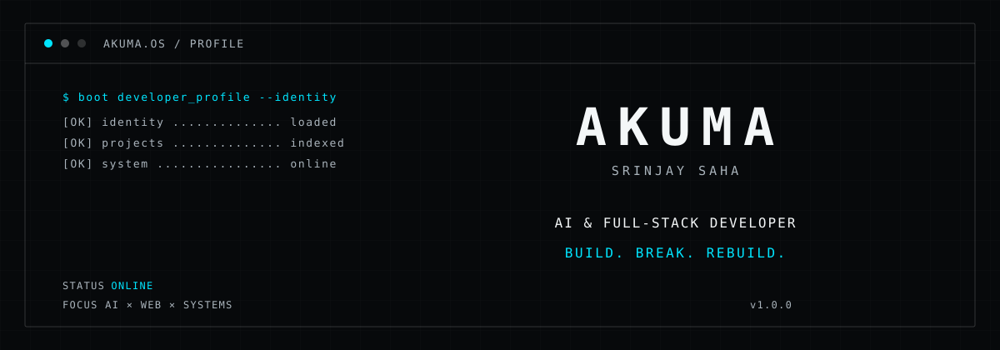

<p align="center">
  
</p>

```text
$ whoami
```

I’m **Srinjay Saha** — an MCA student and AI & full-stack developer building useful, slightly experimental software. I enjoy taking an idea from rough concept to a working system, then finding the parts worth rebuilding.

```text
focus: AI × web × systems
status: building
```

## `./featured-builds`

| | Build | What it is | Built with |
| :-- | :-- | :-- | :-- |
| `01` | [**DEMON CIPHER**](https://github.com/srinjaysaha1605/demon-cipher) | Offline, zero-knowledge password manager and generator with real-time entropy analysis. [LIVE](https://demon-cipher.netlify.app/) | React · TypeScript · Tailwind · Web Crypto |
| `02` | [**AI QUEST STUDY RPG**](https://github.com/srinjaysaha1605/aiquest-studyrpg) | An 8-bit study adventure where generative AI turns academic topics into curriculum-driven battles. | React · TypeScript · Generative AI · Supabase |
| `03` | **VOID_CHAT** | A real-time, terminal-inspired messaging experiment. | React · Supabase Realtime · PostgreSQL |
| `04` | [**MC-CLAN**](https://github.com/srinjaysaha1605/mc-clan) | Tactical player database and roster manager with interactive terminal controls and real-time data. | TypeScript · React · Supabase |
| `05` | [**LEDGERLY**](https://github.com/srinjaysaha1605/Ledgerly) | Arcade-themed personal finance tracking built to make budgeting and wealth tracking feel less like paperwork. | TypeScript · React · Supabase |
| `06` | [**SMART TEXT SUMMARIZER**](https://github.com/srinjaysaha1605/smart-text-summarizer) | Document summarization with NLP insights, entity/sentiment analysis, and RAG-powered chat. | Python · NLP · RAG |

<sub>More experiments live in the <a href="https://github.com/srinjaysaha1605?tab=repositories">repository index</a>.</sub>

## `cat /etc/stack`

```text
LANGUAGES    Python · TypeScript · JavaScript · SQL
FRONTEND     React · HTML · CSS · Tailwind CSS
BACKEND      Node.js · Supabase · Firebase · PostgreSQL
AI / ML      Generative AI · NLP · RAG · scikit-learn · PyTorch
TOOLING      Git · GitHub · Vite
```

## `tail -f /var/log/akuma.log`

```text
[online]    building AI-assisted applications
[online]    experimenting with realtime and intelligent interfaces
[online]    learning by shipping, breaking, and rebuilding
```

## `./connect`

```text
GITHUB       github.com/srinjaysaha1605
PORTFOLIO    akumasportfolio.vercel.app
```

<p>
  <a href="https://github.com/srinjaysaha1605">GITHUB</a>
  &nbsp;·&nbsp;
  <a href="https://akumasportfolio.vercel.app/">PORTFOLIO</a>
</p>

```text
// AKUMA
// BUILD. BREAK. REBUILD.
// EOF
```
