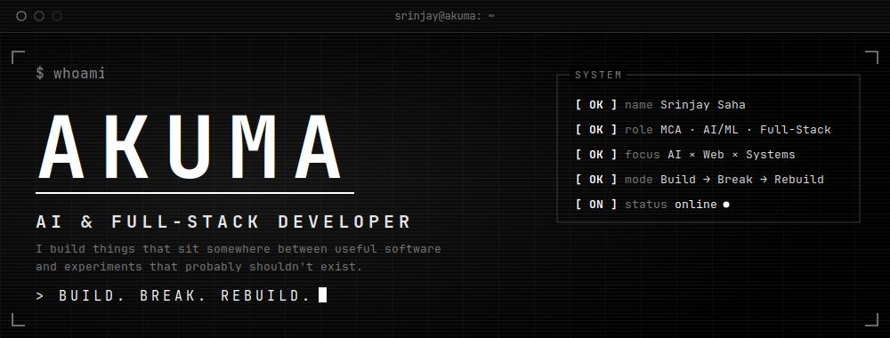
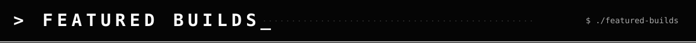
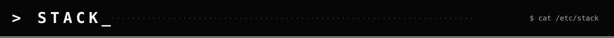
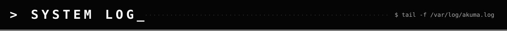
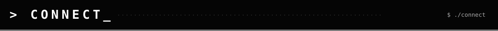

<p align="center">
  
</p>

```text
$ whoami

Srinjay Saha
MCA Student · AI / ML · Full-Stack

I build things that sit somewhere between useful software
and experiments that probably shouldn't exist.

focus:  AI × web × systems
mode:   BUILD → BREAK → REBUILD
status: online
```

<p></p>

> A few things I've built, broken, rebuilt, and shipped.

### `01` — [MORPHOS](https://github.com/srinjaysaha1605/Morphos)  ·  [LIVE ↗](https://morphos-gen.vercel.app/)
**Generative Evolutionary Specimen Laboratory**  
A procedural art system where mathematical organisms evolve through human selection: recursive geometry, radial symmetry, seeded randomness, crossover, mutation, and Canvas rendering. No generative AI involved.

`TypeScript` · `Canvas` · `Generative Systems` · `Genetic Algorithms`

### `02` — [ENCRYPT](https://github.com/srinjaysaha1605/Encrypt)  ·  [LIVE ↗](https://encrypt-ars-cryptographica.vercel.app/)
**Interactive Cryptography Laboratory**  
A terminal-driven learning environment built around real browser cryptography primitives: hashing, AES-GCM, HMAC, key derivation, CSPRNGs, public-key cryptography, signatures, certificates, and TLS.

`React` · `TypeScript` · `Web Crypto API` · `Cryptography`

### `03` — [SYNAPSE AI](https://github.com/srinjaysaha1605/synapseai-personacognitivenetwork)  ·  [LIVE ↗](https://synapseai-personacognitivenetwork.netlify.app/)
**Multi-Persona Cognitive Reasoning Engine**  
An AI workspace built around specialized reasoning modes instead of one generic chatbot. Switch personas, create custom ones, inspect their rules, stream responses, and preserve conversations.

`React` · `TypeScript` · `Gemini` · `Node.js` · `Express`

### `04` — [E-COMMERCE RECSYS](https://github.com/srinjaysaha1605/ecommerce-recsys)  ·  [LIVE ↗](https://ecom-customer-insights.streamlit.app/)
**Customer Analytics & Recommendation System**  
A full-stack ML system combining segmentation, collaborative filtering, churn prediction, and customer-lifetime-value forecasting.

`Python` · `Pandas` · `Scikit-learn` · `XGBoost` · `ALS` · `Streamlit`

### `05` — [AI QUEST](https://github.com/srinjaysaha1605/aiquest-studyrpg)  ·  [LIVE ↗](https://aiquest-studyrpg.netlify.app/)
**AI-Powered Study RPG**  
Turns studying into an 8-bit RPG: academic topics become quests, questions become battles, and progress persists across sessions.

`React` · `TypeScript` · `Gemini` · `Supabase` · `Netlify`

> [`MORE →`](https://github.com/srinjaysaha1605?tab=repositories) — experiments, prototypes, and works in progress.

<p></p>

```text
LANGUAGES   Python · TypeScript · JavaScript · SQL
BUILD       React · Node.js · Vite · HTML · CSS · Tailwind CSS
DATA        PostgreSQL · Supabase · Firebase
AI / ML     Generative AI · NLP · RAG · Scikit-learn · XGBoost · PyTorch
SYSTEMS     Web Crypto · Canvas · Realtime Systems · REST APIs
TOOLING     Git · GitHub · Netlify · Vercel · Google AI Studio
```

<p></p>

```text
[ OK ] building AI-assisted applications
[ OK ] experimenting with realtime systems
[ OK ] exploring machine learning beyond notebooks
[ OK ] turning mathematical ideas into interfaces
[ OK ] learning by shipping
[ OK ] breaking things, then rebuilding them better

[....] next experiment loading
```

<p></p>

<p align="center">
  <a href="https://github.com/srinjaysaha1605"></a>
  <a href="https://akumasportfolio.vercel.app/"></a>
  <a href="https://www.linkedin.com/in/srinjaysaha1605/"></a>
</p>

<p align="center">
  
</p>
